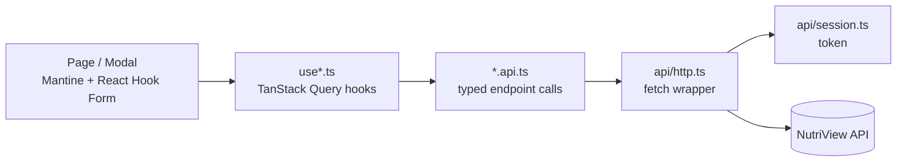

# NutriView Web

[](https://react.dev/)
[](https://www.typescriptlang.org/)
[](https://vite.dev/)
[](https://mantine.dev/)
[](https://tanstack.com/query)
[](https://vite-pwa-org.netlify.app/)

Front end for **NutriView**, a calorie-tracking application built as a Master's thesis
project. It is a mobile-first, installable PWA: log what you eat into meals, watch the
day's calories and macros fill a ring against your goal, keep a food catalogue, set a
daily nutrition target and meal reminders.

It is a pure client — all data and all business rules live in the API. The backend is
[NutriView-API](https://github.com/NutriView/NutriView-API), and **it must be running
for this app to do anything.**

---

## Table of contents

- [Screens](#screens)
- [Tech stack](#tech-stack)
- [Architecture](#architecture)
- [Project structure](#project-structure)
- [Getting started](#getting-started)
- [Configuration](#configuration)
- [API types](#api-types)
- [Authentication](#authentication)
- [Data-fetching conventions](#data-fetching-conventions)
- [PWA](#pwa)
- [Scripts](#scripts)
- [Roadmap](#roadmap)
- [Related repositories](#related-repositories)

---

## Screens

| Route | Screen | What it does |
| --- | --- | --- |
| `/login` | Login | Email + password; on success stores the session and lands on the log |
| `/register` | Register | Creates the account and signs straight in — no second login step |
| `/` | Daily Log | Date picker, a calorie ring with macro bars, and the day's entries grouped into Breakfast / Lunch / Dinner / Snack, each with an add and delete action |
| `/foods` | Foods | The shared food catalogue: create, edit and delete foods with full macros, a measurement base, and a shared/global flag |
| `/goal` | Goal | The daily macro target, with the resulting calorie total previewed as you type |
| `/reminders` | Reminders | A time of day per meal, each shown as Active or Off and edited in a modal with an active switch |
| `/profile` | Profile | Nickname, calorie goal, weight, height, age, gender; and sign out |

Everything except `/login` and `/register` sits behind `RequireAuth`, which redirects
to `/login` when there is no live session. The signed-in routes share an `AppLayout`
with a fixed header and a five-tab bottom bar — the layout is built for a phone and
scales up, rather than the reverse.

## Tech stack

| Area | Choice |
| --- | --- |
| Framework | React 19 with TypeScript 5.7 |
| Build tool | Vite 6 |
| UI | Mantine 8 (`@mantine/core`, `dates`, `hooks`, `notifications`) |
| Server state | TanStack Query 5 |
| Routing | React Router 7 (`createBrowserRouter`) |
| Forms | React Hook Form + Zod, via `@hookform/resolvers` |
| Dates | dayjs (Mantine's date adapter) |
| PWA | `vite-plugin-pwa` (Workbox, auto-update) |
| API types | `openapi-typescript`, generated from the API's Swagger document |

## Architecture

The app is organised by **feature slice**, not by file type. Each feature under
`src/features/` owns its pages, its Zod schemas, its API calls and its Query hooks, and
every slice follows the same three-file pattern:



- **`*.api.ts`** — one thin function per endpoint. Typed in and out, no state, no
  caching, no error handling beyond letting `ApiError` propagate.
- **`use*.ts`** — the TanStack Query layer: query keys, `useQuery` / `useMutation`,
  cache invalidation on success, and the toast on failure. Components never call an
  `.api.ts` function directly.
- **Components** — Mantine UI plus React Hook Form. Validation lives in a sibling
  `schemas.ts` as a Zod schema, so a form's rules are readable in one place.

Three shared modules sit under `src/api/`:

- **`http.ts`** — a small `fetch` wrapper (`http.get/post/put/del`). It attaches the
  bearer token, unwraps `204 No Content`, and turns failures into an `ApiError` that
  carries the HTTP status plus flattened ASP.NET `ModelState` field errors, so a
  validation failure from the server can be shown next to the field that caused it.
- **`session.ts`** — the only place the stored session is read or written.
- **`types.ts`** — the API contract (see [API types](#api-types)).

`src/lib/` holds the pure helpers: local day keys and formatting (`date.ts`), .NET
`TimeSpan` ↔ `<input type="time">` conversion (`timespan.ts`), enum-to-label lists for
selects (`enums.ts`), and `nutrition.ts`, which mirrors the backend's calorie formula
**for display only** — the server stays the source of truth and its value is what gets
stored.

## Project structure

```
src/
├── api/
│   ├── http.ts          fetch wrapper: bearer token, 204s, ApiError
│   ├── session.ts       read/write/clear the stored session
│   ├── types.ts         generated request DTOs + hand-authored response types
│   ├── schema.d.ts      generated by `npm run gen:api` — do not edit
│   └── meals.ts         the four seeded meals, mapped client-side
├── app/
│   ├── router.tsx       routes, with RequireAuth wrapping the signed-in layout
│   ├── AppShell.tsx     header + bottom tab bar
│   ├── theme.ts         Mantine theme (teal, md radius)
│   └── queryClient.ts   30 s staleTime, no retry on 4xx
├── components/          DailySummary (ring + macro bars), DeleteButton, NumberField
├── features/
│   ├── auth/            AuthContext, RequireAuth, Login, Register
│   ├── food-entries/    Daily Log, MealSection, AddEntryModal
│   ├── foods/           catalogue page and form modal
│   ├── nutrition-goal/  daily macro target
│   ├── profile/         profile edit + sign out
│   └── reminders/       per-meal reminder times
├── lib/                 date, timespan, enum and nutrition helpers
└── main.tsx             provider stack: Mantine -> Notifications -> Query -> Auth -> Router
```

## Getting started

### Prerequisites

- **Node.js 20+** (Vite 6 supports 18, 20 and 22+)
- **The API running locally** — see
  [NutriView-API](https://github.com/NutriView/NutriView-API). Start it with
  `dotnet run --launch-profile https`, which serves `http://localhost:5010`.

### Run it

```bash
git clone https://github.com/NutriView/NutriView-React.git
cd NutriView-React

npm install
npm run dev          # http://localhost:5173
```

Then register an account from `/register` — the app signs you in immediately.

The Vite dev server proxies `/api` to `http://localhost:5010`, so the browser sees
one origin and CORS is never exercised in development. If requests fail with
`ECONNREFUSED`, the API is not running (or is on a different port — check the
`server.proxy` target in `vite.config.ts` against the API's launch profile).

## Configuration

One variable, read in `src/api/http.ts` as `import.meta.env.VITE_API_BASE`:

| File | Value | Why |
| --- | --- | --- |
| `.env.development` | `/api` | Relative, so the Vite proxy handles it |
| `.env.production` | `https://localhost:5000/api` | Absolute — point this at the deployed API |

Both files are checked in as defaults; override locally with `.env.local`, which is
git-ignored.

When you deploy, the production origin must also be added to the API's CORS policy
(`Program.cs`), which currently allows only `http://localhost:5173`. The app sends no
cookies — the token travels in the `Authorization` header — so credentialed CORS is
not needed.

## API types

Request DTOs and enums are **generated** from the API's OpenAPI document:

```bash
# with the API running
npm run gen:api      # -> src/api/schema.d.ts
```

`src/api/types.ts` re-exports those generated types under friendly names, so features
import `FoodEntryCreateDTO` rather than reaching into `components['schemas']`.

Response types in that file are **hand-authored**, deliberately. The API's actions
return `IActionResult` without `[ProducesResponseType]`, so the OpenAPI document
describes no response bodies — there is nothing to generate. The interfaces mirror the
C# `*ResponseDTO` classes exactly; if the backend ever annotates its responses, they can
be replaced with generated ones. That trade-off is noted in the file itself so it does
not read as an oversight.

## Authentication

The API is JWT-based and takes the caller's identity from the token, so **no request in
this app sends a user id**. What the client holds is the session:

```ts
// localStorage key: "nutriview.auth"
{ token: string, expiresAt: string, user: UserResponse }
```

- `session.ts` is the single reader and writer. `readSession()` returns `null` when the
  token is missing **or already past `expiresAt`**, so an expired session is treated as
  signed out before a doomed request is ever sent.
- `http.ts` attaches `Authorization: Bearer <token>` when a session exists. If the API
  answers `401` **to a request that actually carried a token**, the session is dropped
  and `RequireAuth` bounces to `/login`. A `401` from `/login` carries no token, so bad
  credentials show an error toast instead of looking like an expiry.
- `AuthContext` holds the session in state, exposes `setSession` (login/register),
  `setUser` (profile edits keep the same token) and `logout`, and listens for the
  `storage` event so signing in or out in one tab is reflected in the others.
- `useCurrentUserId()` still exists, but only to scope cached queries — see below.

There is no refresh token: when the access token expires (7 days by default), the next
request lands the user back on the login screen.

## Data-fetching conventions

- **Query keys are scoped by user id** — `['foodEntries', userId]` — even though the
  request itself carries no id. It keeps two accounts' caches apart in the same browser,
  so switching users never shows a flash of the previous one's data.
- **`staleTime` is 30 s**, so tab switches do not refetch constantly.
- **4xx responses are never retried** (`queryClient.ts`); only transient failures are,
  and only twice. Retrying a `400` just repeats the same mistake.
- **Mutations invalidate, then toast.** Every mutation hook invalidates the affected
  query key on success and shows a Mantine notification — green on success, red with
  the server's message on failure.

## PWA

`vite-plugin-pwa` runs in `autoUpdate` mode: a new deployment installs its service
worker and takes effect on the next load, with no update prompt. The manifest ships
standalone display, a teal theme, and 192/512 icons plus a maskable variant, so the app
installs to a phone home screen and opens without browser chrome.

The service worker is generated at build time — run `npm run build && npm run preview`
to exercise the installed behaviour; `npm run dev` does not fully represent it.

## Scripts

| Script | What it does |
| --- | --- |
| `npm run dev` | Vite dev server on port 5173, proxying `/api` to the backend |
| `npm run build` | `tsc -b` then `vite build` — type errors fail the build |
| `npm run preview` | Serves the production build, service worker included |
| `npm run gen:api` | Regenerates `src/api/schema.d.ts` from the running API's Swagger doc |

## Roadmap

Not built yet — most of these wait on backend endpoints:

- Photo-based food logging, once the API's AI recognition lands
- A statistics and trends dashboard (weight, calories, macros over time)
- Notification delivery for reminders, rather than storing times only
- Offline logging with background sync

## Related repositories

- [NutriView-API](https://github.com/NutriView/NutriView-API) — the backend: an
  ASP.NET Core 10 Web API on EF Core and SQL Server, with JWT auth and server-side
  nutrition calculation. This app's request types are generated from its Swagger
  document.
